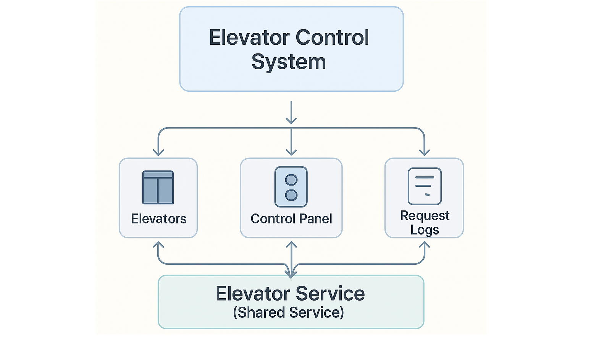

# Elevator Control System

A simplified elevator control system simulation built using **Angular 14**, **TypeScript**, and **Bootstrap 5**. This application demonstrates the basics of elevator scheduling, floor request handling, and real-time elevator status tracking.

---

## 🎯 Features

- ✅ Supports **10 floors** and **4 elevators**
- 📶 Handles **random and manual floor requests**
- ⚙️ Uses a naive elevator assignment algorithm for simplicity
- 📊 Live status updates: direction, busy state, floor queues
- 📝 Request logs for debugging and tracking elevator movements
- 🗂️ Smooth UI using Bootstrap 5 and simple animations

---

## 🛠️ Tech Stack

- [Angular 14](https://angular.io/)
- [Bootstrap 5](https://getbootstrap.com/)
- [TypeScript](https://www.typescriptlang.org/)

---

## System Diagram

Here's a high-level visual representation of the Elevator Control System and how the components interact:



- `Elevator Control System`: Parent component that manages the overall structure.
- `Elevators`, `Control Panel`, `Request Logs`: Child components of the control system.
- `Elevator Service`: Central shared service that facilitates communication between all components.

This modular design ensures maintainability and clean separation of concerns.

---

## 🚧 Project Setup

### 1. Clone the Repository

```bash
git clone https://github.com/your-username/elevator-system.git
cd elevator-system
```

### 2. Install Dependencies

```bash
npm install
```

### 3. Run the App

```bash
ng serve
```

Open your browser and navigate to: [http://localhost:4200](http://localhost:4200)

---

## 🧪 Running Unit Tests

```bash
ng test
```

This will launch Karma and run all unit tests in watch mode.

---

## 🗂️ Project Structure

```
src/
│
├── app/
│   ├── elevator-system/
│   │   ├── components/
│   │   ├── constants/
│   │   ├── models/
│   │   ├── services/
│   │   └── elevator-system.module.ts
│   └── app.component.ts
│   └── app.module.ts
│
├── assets/
├── environments/
├── index.html
├── styles.scss
└── main.ts
```

---

## 📦 Deployment

This application is deployed via GitHub Pages.

### 🔧 Steps to Deploy

1. Build the project for production:

   ```bash
   ng build --base-href "https://agrawal-yatin.github.io/elevator-system/"
   ```

2. Deploy using the Angular CLI GitHub Pages tool:

   ```bash
   npx angular-cli-ghpages --dir=dist/elevator-system
   ```

Make sure the `baseHref` in your `angular.json` is set properly for GitHub Pages.

### 🌍 Live Demo

Check out the live application here: <a href="https://agrawal-yatin.github.io/elevator-system/" target="_blank">🛗 Elevator Control System</a>

---

## 🙋‍♂️ Contributing

PRs are welcome! If you'd like to improve the elevator algorithm, add more features, or improve the UI—feel free to fork the repo and submit a pull request.

---

## 👨‍💻 Author

Developed by [Yatin Agrawal](https://github.com/agrawal-yatin)
